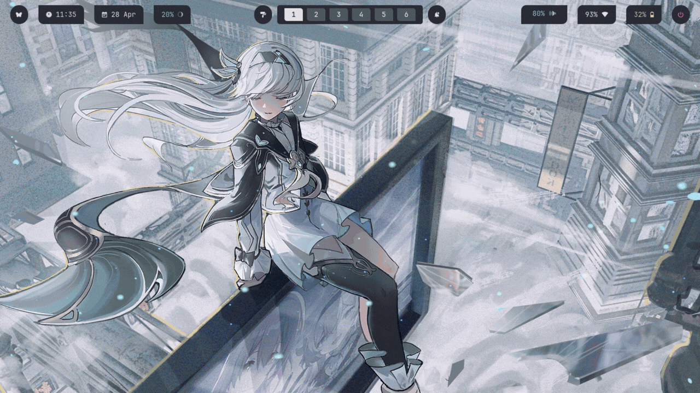

<a id="readme-top"></a>
<br />

<div align="center">

  <h3 align="center">Hyprdots</h3>

  <p align="center">
      A Hyprland setup focused on multi-theme support, smooth switching, and a clean workflow.
    <br />
    <br />
    <a href="#demo">View Demo</a>
    ·
    <a href="https://github.com/vignesh-g-05/dotfiles/issues">Report Bug</a>
    ·
    <a href="https://github.com/vignesh-g-05/dotfiles/issues">Request Feature</a>
  </p>
</div>

---

<div id="demo"></div>



---

## Features

- 3 themes × 6 variants
- Rofi-based variant switcher
- Custom Waybar setup
- SwayNC notifications + SwayOSD integration
- Styled Hyprlock with dynamic backgrounds
- Smooth wallpaper transitions

---

## Components

- **WM:** Hyprland
- **Bar:** Waybar
- **Notifications:** SwayNC
- **OSD:** SwayOSD
- **Terminal:** Kitty
- **Launcher:** Rofi
- **Network Applet:** Orbit
- **File Manager:** Nautilus

---

## Installation

```sh
git clone https://github.com/vignesh-g-05/dotfiles ~/dotfiles
cd ~/dotfiles
./install.sh
```

### Supported

- Fedora ✅
- Arch ⚠️ (experimental)

> This setup is not fully plug-and-play. Basic knowledge of Hyprland is expected.

---

## Theme System

Centralized theme system for managing wallpapers, colors, and UI elements across variants.

Each variant updates:

- Wallpaper
- Hyprlock background
- Fastfetch image
- UI colors
- gtk theme

---

## Contact

**Vignesh G**

- Email: [vignesh.g.2805@gmail.com](mailto:vignesh.g.2805@gmail.com)
- LinkedIn: [https://www.linkedin.com/in/-vignesh-g](https://www.linkedin.com/in/-vignesh-g)
- GitHub: [https://github.com/vignesh-g-05](https://github.com/vignesh-g-05)

---

## Notes

- Built for personal use and customization
- Expect minor adjustments for different systems
- Tested primarily on Fedora

---

<p align="right">(<a href="#readme-top">back to top</a>)</p>
