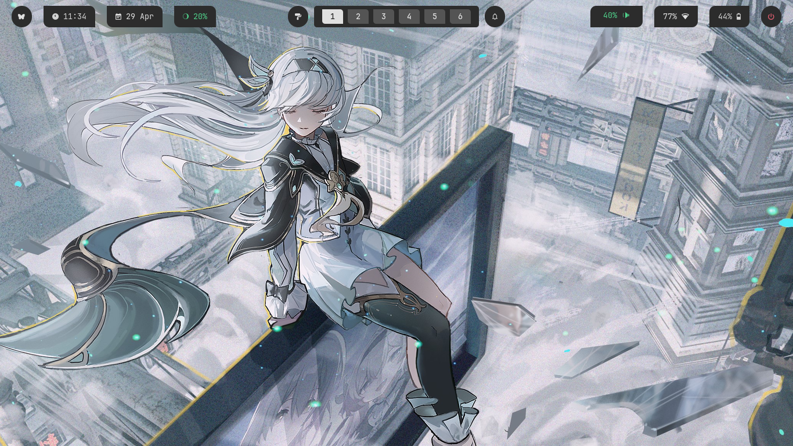
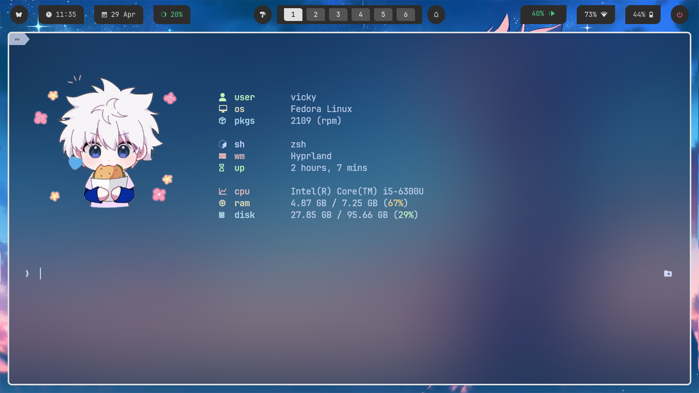
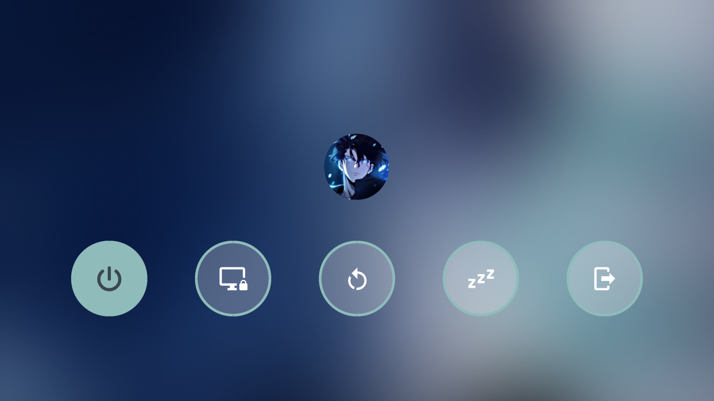
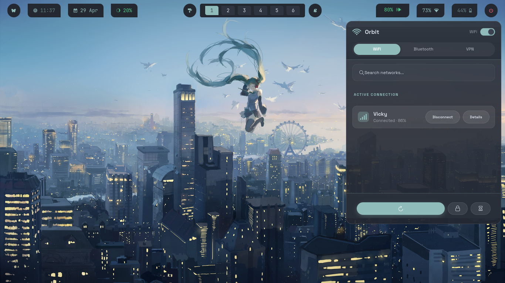
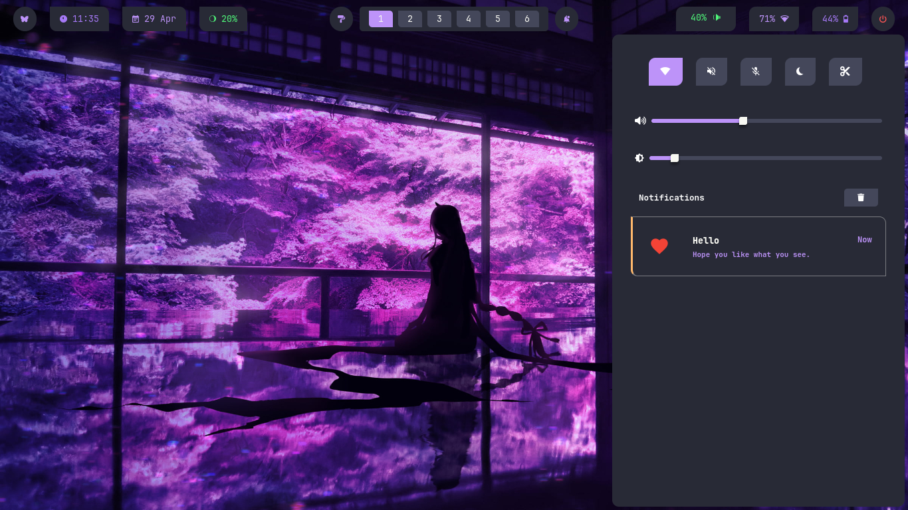
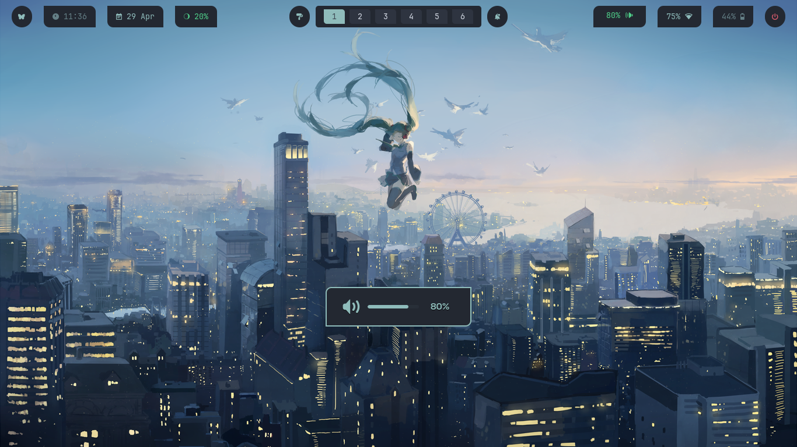
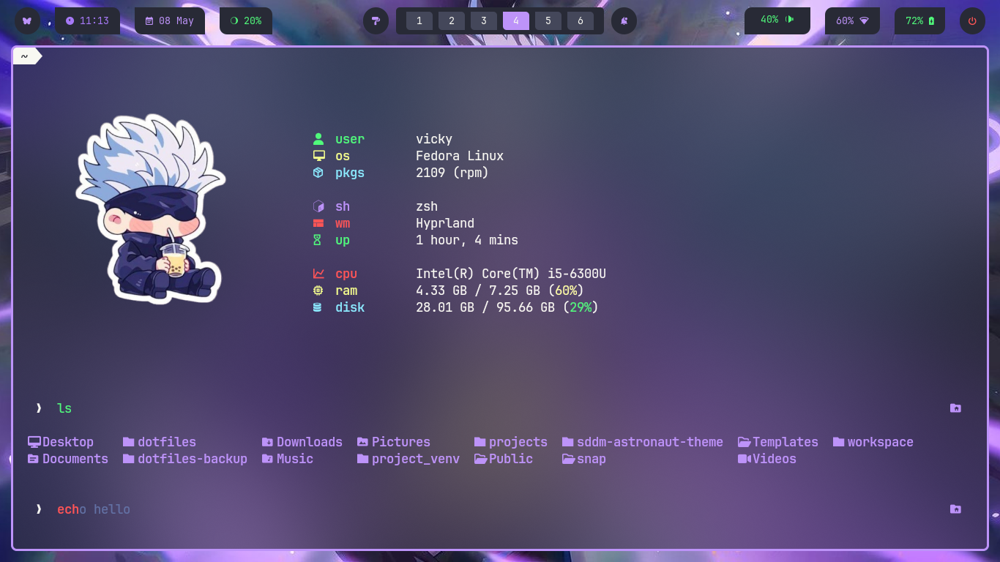
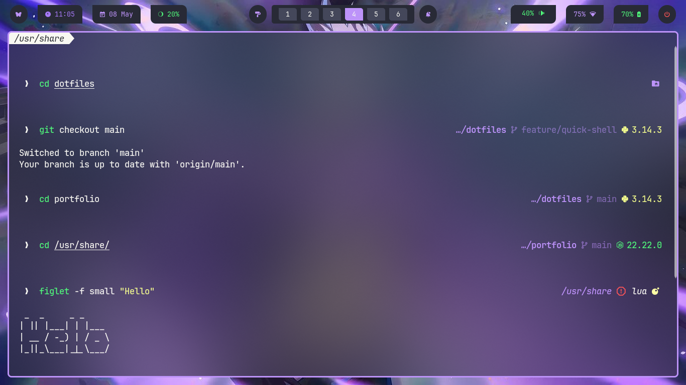

<a id="readme-top"></a>
<br />

<div align="center">

  <h3 align="center">Vypr</h3>

  <p align="center">
      A Hyprland setup focused on multi-theme support, smooth switching, and a clean workflow.
    <br />
    <br />
    <a href="https://vignesh-g-05.github.io/dotfiles/assets/demo.mp4">View Demo</a>
    ·
    <a href="https://github.com/vignesh-g-05/dotfiles/issues">Report Bug</a>
    ·
    <a href="https://github.com/vignesh-g-05/dotfiles/issues">Request Feature</a>
  </p>
</div>

---

<div id="demo"></div>


---

## Features

- Centralized multi-theme system
- 3 themes × 6 variants
- Rofi-based theme/variant switcher
- Shared color and asset management across components
- Integrated Hyprland desktop workflow
- Automated installation script
- Modular configuration structure
- Themed terminal, editor, notifications, launcher, and lockscreen

---

## Components

<details>
  <summary><b>Waybar</b></summary>

  <br />

  <div align="center">
    <p align="center">
      <a
        href="https://github.com/vignesh-g-05/dotfiles/tree/main/waybar/.config/waybar"
      >
        View Config
      </a>
      &nbsp;•&nbsp;
      <a href="https://github.com/alexays/waybar"> Official Repo </a>
    </p>
    
  </div>
</details>
<br />
<details>
  <summary><b>Fastfetch</b></summary>

  <br />

  <div align="center">
    <p align="center">
      <a
        href="https://github.com/vignesh-g-05/dotfiles/blob/main/fastfetch/.config/fastfetch/config.jsonc"
      >
        View Config
      </a>
      &nbsp;•&nbsp;
      <a href="https://github.com/fastfetch-cli/fastfetch"> Official Repo </a>
    </p>
    
  </div>
</details>
<br />
<details>
  <summary><b>Hyprlock</b></summary>

  <br />

  <div align="center">
    <p align="center">
      <a
        href="https://github.com/vignesh-g-05/dotfiles/blob/main/hyprland/.config/hypr/hyprlock.conf"
      >
        View Config
      </a>
      &nbsp;•&nbsp;
      <a href="https://github.com/hyprwm/hyprlock"> Official Repo </a>
    </p>
    
  </div>
</details>
<br />
<details>
  <summary><b>Rofi - Power Menu</b></summary>

  <br />

  <div align="center">
    <p align="center">
      <a
        href="https://github.com/vignesh-g-05/dotfiles/blob/main/rofi/.config/rofi/themes/power-menu.rasi"
      >
        View Config
      </a>
      &nbsp;•&nbsp;
      <a href="https://github.com/davatorium/rofi"> Official Repo </a>
    </p>
    
  </div>
</details>
<br />
<details>
  <summary><b>Orbit - Network Manager</b></summary>

  <br />

  <div align="center">
    <p align="center">
      <a
        href="https://github.com/vignesh-g-05/dotfiles/tree/main/orbit/.config/orbit"
      >
        View Config
      </a>
      &nbsp;•&nbsp;
      <a href="https://github.com/LifeOfATitan/orbit"> Official Repo </a>
    </p>
    
  </div>
</details>
<br />
<details>
  <summary><b>Sway Notification Center</b></summary>

  <br />

  <div align="center">
    <p align="center">
      <a
        href="https://github.com/vignesh-g-05/dotfiles/tree/main/swaync/.config/swaync"
      >
        View Config
      </a>
      &nbsp;•&nbsp;
      <a href="https://github.com/ErikReider/SwayNotificationCenter"> Official Repo </a>
    </p>
    
  </div>
</details>
<br />
<details>
  <summary><b>SwayOSD</b></summary>

  <br />

  <div align="center">
    <p align="center">
      <a
        href="https://github.com/vignesh-g-05/dotfiles/tree/main/swayosd/.config/swayosd"
      >
        View Config
      </a>
      &nbsp;•&nbsp;
      <a href="https://github.com/ErikReider/SwayOSD"> Official Repo </a>
    </p>
    
  </div>
</details>
<br />
<details>
  <summary><b>Zsh</b></summary>

  <br />

  <div align="center">
    <p align="center">
      <a
        href="https://github.com/vignesh-g-05/dotfiles/blob/main/zsh/.zshrc"
      >
        View Config
      </a>
      &nbsp;•&nbsp;
      <a href="https://www.zsh.org/"> Official Repo </a>
    </p>
    
  </div>
</details>
<br />
<details>
  <summary><b>Starship</b></summary>

  <br />

  <div align="center">
    <p align="center">
      <a
        href="https://github.com/vignesh-g-05/dotfiles/blob/main/starship/.config/starship.toml"
      >
        View Config
      </a>
      &nbsp;•&nbsp;
      <a href="https://starship.rs/"> Official Repo </a>
    </p>
    
  </div>
</details>

---

## Installation

```sh
git clone https://github.com/vignesh-g-05/dotfiles ~/dotfiles
cd ~/dotfiles
./install.sh
```

### Supported

- Fedora ✅
- Arch ⚠️ (experimental)

> This setup is not fully plug-and-play. Basic knowledge of Hyprland is expected.

---

## Theme System

Themes are managed through a centralized system that updates wallpapers, UI colors, Hyprlock backgrounds, and Fastfetch assets across all variants.

<p>
  <a href="https://github.com/vignesh-g-05/dotfiles/tree/main/themes/.config/themes">
    View Theme Configs
  </a>
</p>

Each variant updates:

- Wallpaper
- Hyprlock background
- Fastfetch image
- UI colors
- GTK theme

---

## Notes

- Tested primarily on Fedora
- Some components may require manual adjustments depending on distro and monitor setup

---

<p align="right">(<a href="#readme-top">back to top</a>)</p>
